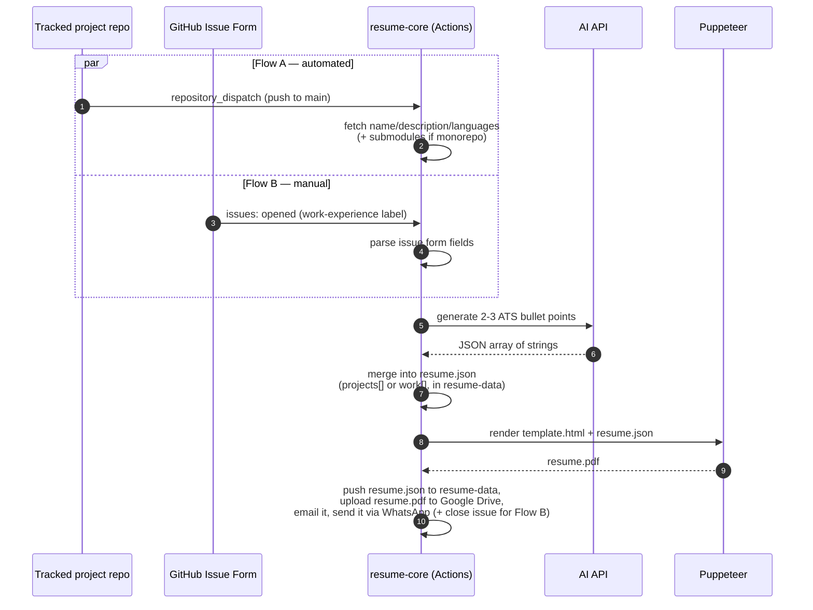

<div align="center">


### The pipeline — data, template, PDF renderer, and every GitHub Actions workflow.


[](https://github.com/ChamathDilshanC/resume-core/actions/workflows/update-resume.yml)
[](https://github.com/ChamathDilshanC/resume-core/actions/workflows/update-work-experience.yml)

</div>

---

An event-driven, zero-backend pipeline that keeps a Software Engineering resume
up to date automatically. Pushes to tagged project repositories and GitHub
Issue Form submissions both flow through GitHub Actions, get rewritten into
professional bullet points by an AI step, and are compiled into `resume.pdf`
via Puppeteer — no server, webhook receiver, or database required.

The raw `resume.json` (contact details, reference phone numbers) lives in a
separate private repo, [`resume-data`](https://github.com/ChamathDilshanC/resume-data),
so it never has to sit in a public repo — this repo checks it out alongside
the pipeline code on every run. The rendered `resume.pdf` is never committed
here either; each run overwrites the same file in Google Drive instead (see
[Google Drive upload](#google-drive-upload) below).

See `architecture.md`, `implementation.md`, and `technologies-used.md` in the
parent repo for the full design rationale.

## Two ways in, one pipeline out



## Repository layout

```
template.html                      Handlebars template for the PDF layout
styles.css                         Print-optimized stylesheet (inlined at render time)
generate-pdf.js                    Compiles template + data and renders resume.pdf via Puppeteer
assets/                            Profile photo + brand logo
scripts/
  fetch-repo-data.js               Fetches repo name/description/languages (+ submodules) from GitHub API
  generate-bullets.js              Calls the AI API and returns a JSON array of bullet points
  merge-project.js                 Appends/updates an entry in resume.json's `projects` array
  merge-work.js                    Appends/updates an entry in resume.json's `work` array
  parse-issue.js                   Parses a submitted Issue Form body into fields
  commit-and-push.sh               Retry-safe commit/push (fetch + rebase on non-fast-forward)
  upload-to-drive.js               Overwrites resume.pdf in Google Drive via the Drive API
  send-email.js                    Emails resume.pdf (with a Drive link) via Gmail SMTP
  send-whatsapp.js                 Uploads resume.pdf to Meta's Graph API and sends it as a document message
  discover-projects.js             Scans your repos and auto-tags untracked meta-repos with resume-project
.github/workflows/
  update-resume.yml                Flow A: repository_dispatch -> AI -> merge -> PDF -> upload to Drive
  update-work-experience.yml       Flow B: issues:opened -> AI -> merge -> PDF -> upload to Drive -> close issue
  regenerate-pdf.yml               workflow_dispatch: re-render the PDF + re-upload (used by resume-admin)
  discover-projects.yml            Daily + workflow_dispatch: runs discover-projects.js
.github/ISSUE_TEMPLATE/
  work-experience.yml              Structured form for manual work experience entries
notifier-template/notify-resume.yml  Template to copy into each tracked project repo
```

`resume.json` itself lives in the private
[`resume-data`](https://github.com/ChamathDilshanC/resume-data) repo — every
workflow here checks it out into `data/` alongside this repo before touching
it (see **One-time setup** below).

## One-time setup

### 1. `resume-core` repository settings
- **Settings → Actions → General → Workflow permissions**: default
  "Read repository contents" permission is enough — nothing in this repo is
  committed back to it anymore (`resume.pdf` goes to Google Drive instead,
  `resume.json` goes to the separate `resume-data` repo via its own PAT).
- **Settings → Secrets and variables → Actions → Secrets**, add:
  - `AI_API_KEY` — a Google AI Studio (Gemini) API key. Can hold several
    comma-separated keys (e.g. from separate Google accounts); if one hits
    its rate limit (429), the next is tried automatically before failing.
    GitHub Models was retired on 2026-07-30 and is no longer usable.
  - `RESUME_DATA_PAT` — a fine-grained PAT scoped to only the
    [`resume-data`](https://github.com/ChamathDilshanC/resume-data) repo,
    with **Contents: Read and write** permission. Every workflow here checks
    that repo out into `data/` to read/edit `resume.json`, then pushes the
    change back — this has to be a PAT (not the default `GITHUB_TOKEN`)
    because `GITHUB_TOKEN` can only ever touch the repo the workflow runs in.
  - `RESUME_CORE_PAT` *(optional)* — only needed if tracked project repos are
    private; used to read their repo/language data.
  - `GDRIVE_CREDENTIALS` — full JSON key of a Google Cloud service account
    (Drive API enabled). See **Google Drive upload** below.
  - `GDRIVE_FILE_ID` — the Drive file ID `resume.pdf` gets uploaded into. See
    **Google Drive upload** below.
  - `SMTP_USER` — the Gmail address the resume gets emailed *from*.
  - `SMTP_APP_PASSWORD` — a 16-character
    [Google App Password](https://myaccount.google.com/apppasswords) for
    that account (needs 2-Step Verification enabled first) — not the
    regular Google account password, which Gmail's SMTP rejects.
  - `RECIPIENT_EMAIL` — the address that receives the resume. Can be the
    same address as `SMTP_USER` to just email yourself.
  - `WHATSAPP_TOKEN` — a Meta access token for a WhatsApp Business app. See
    **WhatsApp delivery** below.
  - `WHATSAPP_PHONE_NUMBER_ID` — the sending number's Phone Number ID (from
    the Meta app dashboard, not the phone number itself).
  - `RECIPIENT_PHONE_NUMBER` — the number to receive the resume, in full
    international format with no `+` or leading zeros (e.g. `9477xxxxxxx`).
- **Settings → Secrets and variables → Actions → Variables** *(optional)*:
  - `AI_MODEL` — override the first Gemini model tried (falls back through
    `gemini-flash-latest` → `gemini-2.5-flash` → `gemini-2.5-flash-lite`
    regardless).

### Google Drive upload

Service accounts have **zero storage quota** on a normal (non-Workspace)
Google account, so they can't *create* new files — but they can overwrite
the *content* of a file a real person already owns and shared with them,
which counts against the owner's quota instead. `scripts/upload-to-drive.js`
relies on exactly that (`files.update` on a fixed file ID), so the one-time
setup has to create the placeholder file yourself first:

1. **Google Cloud Console** → create/select a project → enable the
   **Google Drive API**.
2. **IAM & Admin → Service Accounts** → create one (no project roles
   needed) → **Keys** → add key → JSON. That downloaded file's contents are
   the `GDRIVE_CREDENTIALS` secret. Note the service account's email
   (`...@...iam.gserviceaccount.com`).
3. In your own Google Drive, upload any placeholder `resume.pdf` (even a
   blank file) — this makes *you* the owner.
4. Share that file with the service account's email, **Editor** access.
5. Open the file and copy the ID out of its URL
   (`drive.google.com/file/d/`**`THIS_PART`**`/view`) — that's the
   `GDRIVE_FILE_ID` secret.

After that, every pipeline run overwrites the same Drive file in place; the
file's shareable link never changes.

### WhatsApp delivery

`scripts/send-whatsapp.js` uploads `resume.pdf` to Meta's Graph API as media,
then sends it via a pre-approved **message template** with a document header
to `RECIPIENT_PHONE_NUMBER`. It has to be a template, not a plain document
message — WhatsApp only allows free-form messages within 24h of the
recipient's last message to the business number, which an unattended
pipeline run will never satisfy. Templates are exempt from that window.

1. Create an app at [developers.facebook.com](https://developers.facebook.com/)
   → add the **WhatsApp** product.
2. The app dashboard's WhatsApp → API Setup page gives you a test number,
   its **Phone Number ID** (`WHATSAPP_PHONE_NUMBER_ID`), and a **temporary**
   access token good for 24 hours — fine for a one-off test, but the pipeline
   needs a token that doesn't expire daily. Generate a **permanent** one
   instead: Business Settings → Users → System Users → create a system user
   → **Generate token** → select the app with `whatsapp_business_messaging`
   permission → that's `WHATSAPP_TOKEN`.
3. **Test-mode restriction:** until the Meta app is business-verified, it can
   only message numbers explicitly added as testers. Add
   `RECIPIENT_PHONE_NUMBER` under WhatsApp → API Setup → "To" → **Manage
   phone number list**, and accept the invite Meta sends to that number —
   otherwise every send silently 400s with "recipient not in allowed list."
4. **Create the template** — Meta Business Manager → WhatsApp Manager →
   Message Templates → Create Template:
   - Category: **Utility**
   - Name: `resume_pdf_update` (must match exactly — this is what the script
     sends; override with a `WHATSAPP_TEMPLATE_NAME` repo variable if you use
     a different name)
   - Language: **English (US)**
   - Header type: **Document** (you'll be asked to upload a sample PDF just
     for the review preview — any PDF works, it's not the one actually sent)
   - Body: e.g. "Your resume has just been updated. Please find the latest
     version attached."
   - Submit for review. Utility templates are usually approved within
     minutes, occasionally up to 24h — check its status is **Active** in
     WhatsApp Manager before expecting sends to succeed.

### 2. Each tracked project repository

You almost never need to do this by hand — see **Auto-discovery** below. To
wire a repo up manually anyway:
- Add the `resume-project` topic to the repo (Settings → topic tags).
- Copy `notifier-template/notify-resume.yml` to
  `.github/workflows/notify-resume.yml` in that repo.
- Add a `RESUME_CORE_PAT` secret (fine-grained PAT with permission to send
  `repository_dispatch` events to `resume-core`) — this can be an
  Organization secret if every tracked repo shares the same owner.
- Update the `repository:` field in the copied workflow if the resume-core
  repo doesn't live at `ChamathDilshanC/resume-core`.

**Two topics, two purposes:**
- `resume-project` — this repo is wired up (has the notifier workflow).
  Push all you want while the project is unfinished; nothing happens yet.
- `resume-ready` — add this topic once the project is actually presentable.
  `fetch-repo-data.js` checks for it on every push and skips the AI/PDF
  steps entirely if it's missing, so half-built projects never leak onto
  the resume. Add the topic, then push (or re-run the workflow) to have it
  appear.

### 3. Auto-discovery — never forget to tag a new repo

`discover-projects.yml` runs daily (and on-demand via `workflow_dispatch`)
and does the `resume-project` half of setup for you:

1. Lists every repo you own.
2. For each one that isn't already tagged `resume-project`, checks whether
   it has a `.gitmodules` file at the root — i.e. it's a "main" meta-repo
   that wraps submodules (the `VibeNet-Main` / `RevvUp-Main-Application`
   pattern), not a leaf `frontend`/`backend` repo.
3. If so: adds the `resume-project` topic and commits a ready-to-use
   `notify-resume.yml` into that repo automatically.
4. Skips anything that's already a *nested* submodule of an already-tracked
   repo (e.g. a microservices "platform" repo referenced by a tracked
   monorepo) so multi-level submodule structures never get double-tracked.

This needs `secrets.RESUME_CORE_PAT` set **on `resume-core` itself** with
broad access (list/read all your repos, write topics, write file contents) —
narrower than that and the scan can't see your other repos at all. It still
can't provision the per-tracked-repo `RESUME_CORE_PAT` secret automatically
(that requires an even broader, secrets-write scope) — that one manual step
remains, and the workflow's summary output lists exactly which repos need it.

The only thing you ever do by hand for a brand-new project: add the
`resume-ready` topic once it's actually done.

### 3. Manual work experience entries
- Open a new issue in `resume-core` using the **New Work Experience** form
  (auto-labeled `work-experience`). Submitting it triggers
  `update-work-experience.yml` automatically and closes the issue once done.

## Local development

```bash
npm install
git clone https://github.com/ChamathDilshanC/resume-data.git data
npm run generate        # renders resume.pdf from data/resume.json + template.html
```

`resume.json` isn't in this repo — clone `resume-data` into `./data` (gitignored)
first, or point `RESUME_JSON_PATH` at wherever your local copy lives.

> **Font note:** the template uses Calibri. Locally on Windows this renders
> with real Calibri; the CI workflows install the metric-compatible
> `fonts-crosextra-carlito` package so GitHub's Linux runners produce
> pixel-equivalent pagination — don't remove that step.

To test the helper scripts locally, set the relevant environment variables
(`GITHUB_TOKEN`, `SOURCE_REPO_OWNER`, `SOURCE_REPO_NAME`, `AI_API_KEY`, etc.)
and run them directly, e.g. `node scripts/fetch-repo-data.js`.
