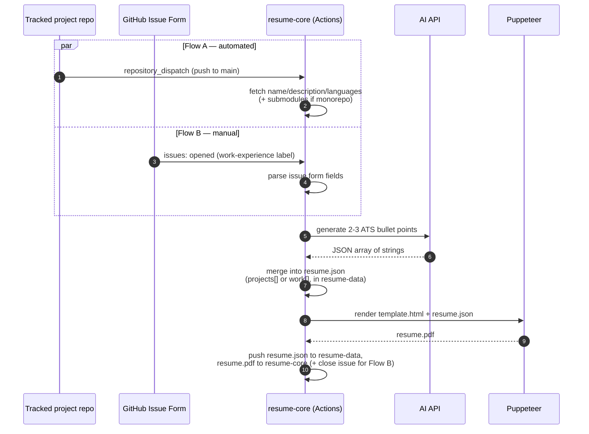

<div align="center">


### The pipeline — data, template, PDF renderer, and every GitHub Actions workflow.


[](https://github.com/ChamathDilshanC/resume-core/actions/workflows/update-resume.yml)
[](https://github.com/ChamathDilshanC/resume-core/actions/workflows/update-work-experience.yml)

</div>

---

An event-driven, zero-backend pipeline that keeps a Software Engineering resume
up to date automatically. Pushes to tagged project repositories and GitHub
Issue Form submissions both flow through GitHub Actions, get rewritten into
professional bullet points by an AI step, and are compiled into `resume.pdf`
via Puppeteer — no server, webhook receiver, or database required.

The raw `resume.json` (contact details, reference phone numbers) lives in a
separate private repo, [`resume-data`](https://github.com/ChamathDilshanC/resume-data),
so it never has to sit in a public repo — this repo checks it out alongside
the pipeline code on every run and only ever publishes the rendered
`resume.pdf`.

See `architecture.md`, `implementation.md`, and `technologies-used.md` in the
parent repo for the full design rationale.

## Two ways in, one pipeline out



## Repository layout

```
template.html                      Handlebars template for the PDF layout
styles.css                         Print-optimized stylesheet (inlined at render time)
generate-pdf.js                    Compiles template + data and renders resume.pdf via Puppeteer
assets/                            Profile photo + brand logo
scripts/
  fetch-repo-data.js               Fetches repo name/description/languages (+ submodules) from GitHub API
  generate-bullets.js              Calls the AI API and returns a JSON array of bullet points
  merge-project.js                 Appends/updates an entry in resume.json's `projects` array
  merge-work.js                    Appends/updates an entry in resume.json's `work` array
  parse-issue.js                   Parses a submitted Issue Form body into fields
  commit-and-push.sh               Retry-safe commit/push (fetch + rebase on non-fast-forward)
  discover-projects.js             Scans your repos and auto-tags untracked meta-repos with resume-project
.github/workflows/
  update-resume.yml                Flow A: repository_dispatch -> AI -> merge -> PDF -> commit
  update-work-experience.yml       Flow B: issues:opened -> AI -> merge -> PDF -> commit -> close issue
  regenerate-pdf.yml               workflow_dispatch: re-render the PDF only (used by resume-admin)
  discover-projects.yml            Daily + workflow_dispatch: runs discover-projects.js
.github/ISSUE_TEMPLATE/
  work-experience.yml              Structured form for manual work experience entries
notifier-template/notify-resume.yml  Template to copy into each tracked project repo
```

`resume.json` itself lives in the private
[`resume-data`](https://github.com/ChamathDilshanC/resume-data) repo — every
workflow here checks it out into `data/` alongside this repo before touching
it (see **One-time setup** below).

## One-time setup

### 1. `resume-core` repository settings
- **Settings → Actions → General → Workflow permissions**: set to
  "Read and write permissions" so `GITHUB_TOKEN` can commit `resume.json` /
  `resume.pdf` back to the repo.
- **Settings → Secrets and variables → Actions → Secrets**, add:
  - `AI_API_KEY` — key for GitHub Models or Google Gemini.
  - `RESUME_DATA_PAT` — a fine-grained PAT scoped to only the
    [`resume-data`](https://github.com/ChamathDilshanC/resume-data) repo,
    with **Contents: Read and write** permission. Every workflow here checks
    that repo out into `data/` to read/edit `resume.json`, then pushes the
    change back — this has to be a PAT (not the default `GITHUB_TOKEN`)
    because `GITHUB_TOKEN` can only ever touch the repo the workflow runs in.
  - `RESUME_CORE_PAT` *(optional)* — only needed if tracked project repos are
    private; used to read their repo/language data.
- **Settings → Secrets and variables → Actions → Variables** *(optional)*,
  override AI provider defaults:
  - `AI_PROVIDER` — `github-models` (default) or `gemini`.
  - `AI_API_URL` — override the chat-completions endpoint.
  - `AI_MODEL` — e.g. `openai/gpt-4o-mini` or `gemini-flash-latest`.

### 2. Each tracked project repository

You almost never need to do this by hand — see **Auto-discovery** below. To
wire a repo up manually anyway:
- Add the `resume-project` topic to the repo (Settings → topic tags).
- Copy `notifier-template/notify-resume.yml` to
  `.github/workflows/notify-resume.yml` in that repo.
- Add a `RESUME_CORE_PAT` secret (fine-grained PAT with permission to send
  `repository_dispatch` events to `resume-core`) — this can be an
  Organization secret if every tracked repo shares the same owner.
- Update the `repository:` field in the copied workflow if the resume-core
  repo doesn't live at `ChamathDilshanC/resume-core`.

**Two topics, two purposes:**
- `resume-project` — this repo is wired up (has the notifier workflow).
  Push all you want while the project is unfinished; nothing happens yet.
- `resume-ready` — add this topic once the project is actually presentable.
  `fetch-repo-data.js` checks for it on every push and skips the AI/PDF
  steps entirely if it's missing, so half-built projects never leak onto
  the resume. Add the topic, then push (or re-run the workflow) to have it
  appear.

### 3. Auto-discovery — never forget to tag a new repo

`discover-projects.yml` runs daily (and on-demand via `workflow_dispatch`)
and does the `resume-project` half of setup for you:

1. Lists every repo you own.
2. For each one that isn't already tagged `resume-project`, checks whether
   it has a `.gitmodules` file at the root — i.e. it's a "main" meta-repo
   that wraps submodules (the `VibeNet-Main` / `RevvUp-Main-Application`
   pattern), not a leaf `frontend`/`backend` repo.
3. If so: adds the `resume-project` topic and commits a ready-to-use
   `notify-resume.yml` into that repo automatically.
4. Skips anything that's already a *nested* submodule of an already-tracked
   repo (e.g. a microservices "platform" repo referenced by a tracked
   monorepo) so multi-level submodule structures never get double-tracked.

This needs `secrets.RESUME_CORE_PAT` set **on `resume-core` itself** with
broad access (list/read all your repos, write topics, write file contents) —
narrower than that and the scan can't see your other repos at all. It still
can't provision the per-tracked-repo `RESUME_CORE_PAT` secret automatically
(that requires an even broader, secrets-write scope) — that one manual step
remains, and the workflow's summary output lists exactly which repos need it.

The only thing you ever do by hand for a brand-new project: add the
`resume-ready` topic once it's actually done.

### 3. Manual work experience entries
- Open a new issue in `resume-core` using the **New Work Experience** form
  (auto-labeled `work-experience`). Submitting it triggers
  `update-work-experience.yml` automatically and closes the issue once done.

## Local development

```bash
npm install
git clone https://github.com/ChamathDilshanC/resume-data.git data
npm run generate        # renders resume.pdf from data/resume.json + template.html
```

`resume.json` isn't in this repo — clone `resume-data` into `./data` (gitignored)
first, or point `RESUME_JSON_PATH` at wherever your local copy lives.

> **Font note:** the template uses Calibri. Locally on Windows this renders
> with real Calibri; the CI workflows install the metric-compatible
> `fonts-crosextra-carlito` package so GitHub's Linux runners produce
> pixel-equivalent pagination — don't remove that step.

To test the helper scripts locally, set the relevant environment variables
(`GITHUB_TOKEN`, `SOURCE_REPO_OWNER`, `SOURCE_REPO_NAME`, `AI_API_KEY`, etc.)
and run them directly, e.g. `node scripts/fetch-repo-data.js`.
